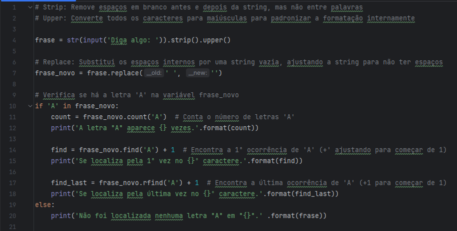
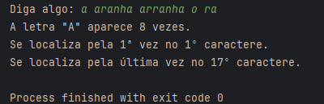
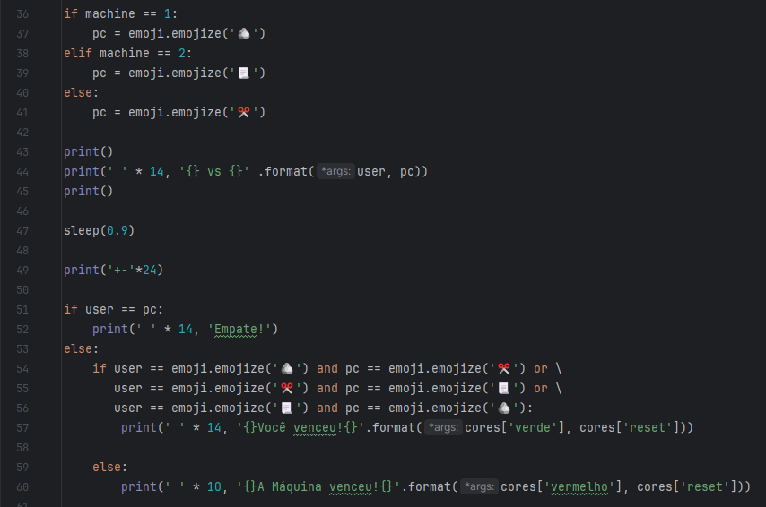
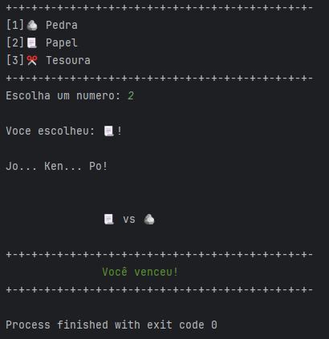
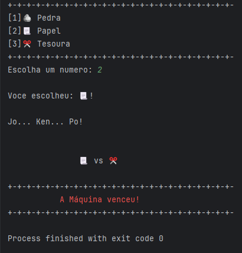
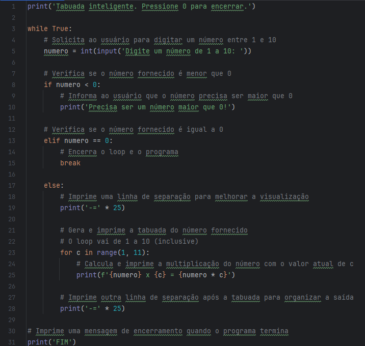
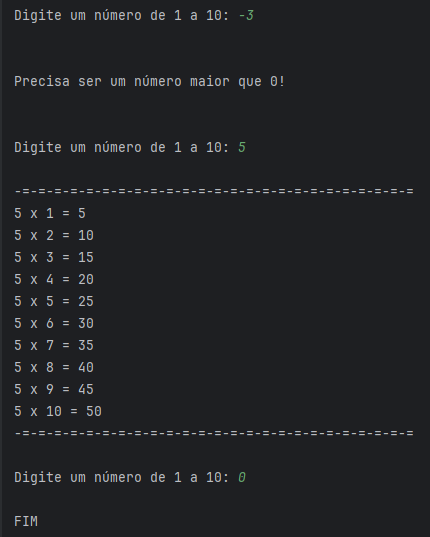

# 📁 Meus estudos com Python

### 📂 Resolução de alguns dos desafios disponíveis nos módulos 1 e 2 do curso Linguagem Python da plataforma Estudonauta/Curso em Vídeo (Gustavo Guanabara).

🛎️ Este repositório é apenas para documentar meu processo de aprendizagem com a linguagem. Pode haver erros em termos técnicos, ou abordagens rasas sobre o assunto. Não é um repositório informativo.

## 📄 Módulo 1 e 2:

### Manipulação de String:

Código:

Resultado:

### Condicionais If, Elif e Else

Código:  

Resultado:

### Tabuada inteligente

Código:

Resultado:

